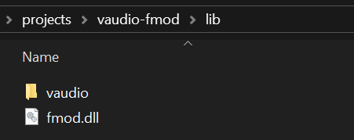
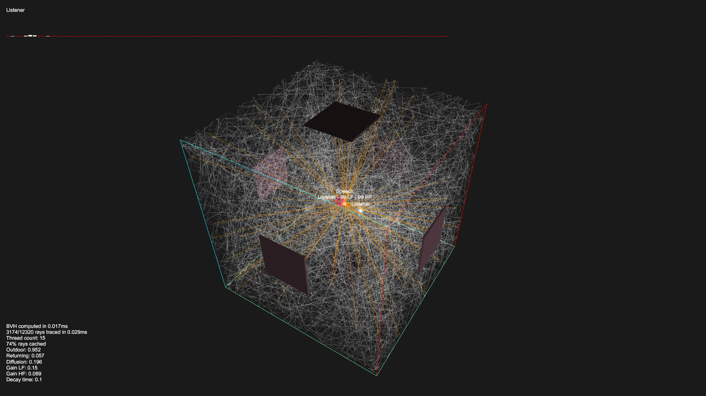

## Vercidium Audio + Wwise Example

This repository requires the Vercidium Audio SDK v1.1.1 and Wwise SDK to run:
- Download the Vercidium Audio SDK from [vercidium.com/audio](https://vercidium.com/audio)
- Download the Wwise SDK from [audiokinetic.com/en/download](https://www.audiokinetic.com/en/download)

> Please note that neither SDK is free for commercial use. See [audiokinetic.com/pricing](https://www.audiokinetic.com/pricing)

## Wwise Setup

Once Wwise is installed, add this to `vaudio-wwise.csproj`:

```xml
<ItemGroup>
    <!-- Replace this with the path to your Wwise SDK -->
    <None Include="C:\Audiokinetic\Wwise2025.1.7.9143\SDK\x64_vc170\Release\bin\AkSoundEngine.dll">
        <CopyToOutputDirectory>PreserveNewest</CopyToOutputDirectory>
    </None>
</ItemGroup>
```

## Vercidium Audio Setup

You can either copy the entire vaudio folder to the `lib` folder:



Or edit `vaudio-wwise.csproj` to point to the folder where the Vercidium Audio SDK lives:

```xml
<PropertyGroup>
    <!-- Replace this with the path to your vaudio SDK -->
    <VAudioDir>lib\vaudio</VAudioDir>
</PropertyGroup>
```

## File Overview

- `wwise/*.cs` contains the C# bindings for Wwise [TODO]
- `WwiseSystem.cs` and `WwiseSound.cs` are helper files for working with Wwise [TODO]
- `resource/audio/speech.ogg` is an example file included for playback
- `Scene.cs` creates a Vercidium Audio context and initialises Wwise [TODO]

Scene.cs is where you can adjust ray counts, add primitives change materials and more. See the [Vercidium Audio docs](https://docs.vercidium.com/raytraced-audio/v110/Getting+Started) for more.

## Controls

Open the project in Visual Studio 2022 or 2026, and press F5 to run the project.

A debug window will appear, which renders the raytracing scene (primitives and rays), an echogram at the top, and raytracing stats in the bottom left.

- Use WASD and the mouse to move the camera
- Press escape to release the mouse
- Press shift/control to increase camera speed

