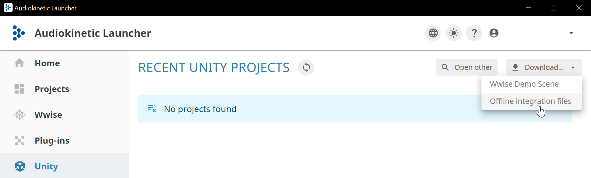
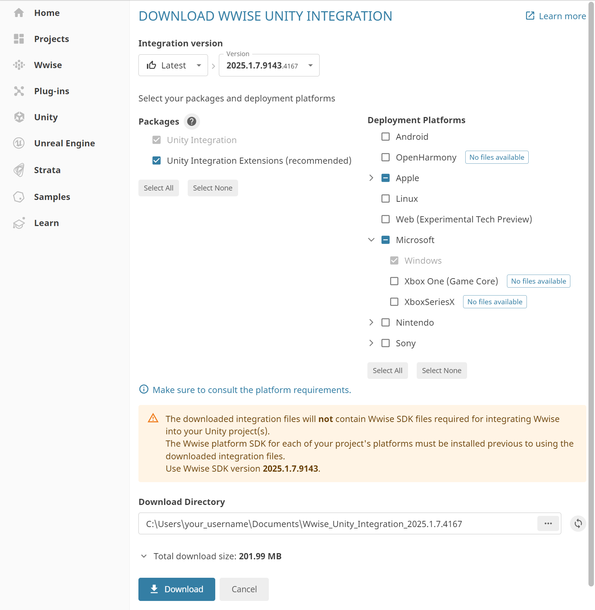
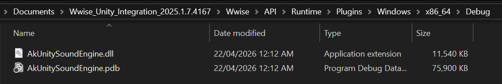

## Vercidium Audio + Wwise Example

This repository requires Vercidium Audio v1.3.1 and Wwise SDK to run:
- Download the Vercidium Audio SDK from [vercidium.com](https://vercidium.com)
- Download the Wwise SDK from [audiokinetic.com/en/download](https://www.audiokinetic.com/en/download)

> Please note that neither SDK is free for commercial use. See [audiokinetic.com/pricing](https://www.audiokinetic.com/pricing) and [vercidium.com/eula](https://vercidium.com/eula)

## Wwise Setup

Once Wwise is installed, you must download the C# bindings for Wwise, which are located in the Unity package:
- Run the Wwise Launcher program
- Select `Unity` on the left sidebar
- Click `Download` in the top-right
- Click `Offline integration files`



Ensure `Microsoft > Windows` is selected on the right, then scroll down and click `Download`



Then extract the `Unity.Windows.tar.xz` file (twice), then open the `Wwise/API/Runtime/Plugins/Windows/x86_64/Debug` folder and copy the `AkUnitySoundEngine.dll` file to the `vaudio-fmod/lib` folder.



## Vercidium Audio Setup

Edit `vaudio-wwise.csproj` to point to the folder where the Vercidium Audio SDK lives:

```xml
<ItemGroup>
	<Reference Include="vaudio">
		<!-- Step 2 - replace this with the path to your Vercidium Audio .NET SDK -->
		<HintPath>C:\Users\YOU\Downloads\vercidium_audio_v1.3.1\dotnet\dev\vaudio.dll</HintPath>
	</Reference>
</ItemGroup>
```

## File Overview

- `wwise/AkSoundEngine.cs` contains the C# bindings for Wwise
- `WwiseSystem.cs` and `WwiseSound.cs` are helper files for working with Wwise 
- `resource/audio` contains soundbank and config files created by the Wwise Authoring program
- `Scene.cs` creates a Vercidium Audio context and initialises Wwise

Scene.cs is where you can adjust ray counts, add primitives, change materials and more. See the [Vercidium Audio docs](https://vercidium.com/docs) for more details.

## Controls

Open the project in Visual Studio 2022 or 2026, and press F5 to run the project.

A debug window will appear that displays:
- the raytracing scene (primitives and rays)
- an echogram at the top
- raytracing stats in the bottom left.

Controls:

- Use WASD and the mouse to move the camera
- Press escape to release the mouse
- Press shift/control to increase camera speed

